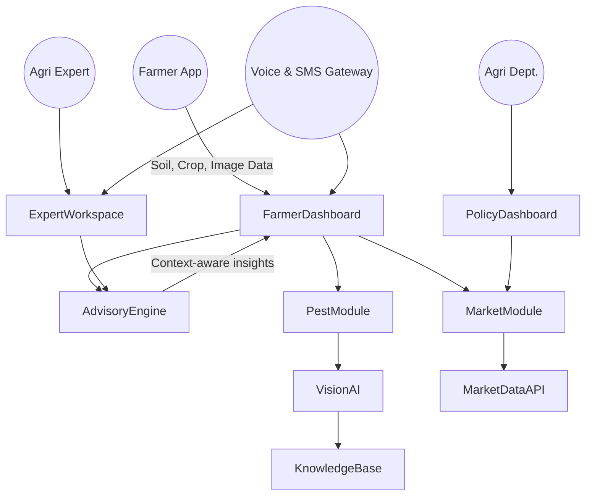
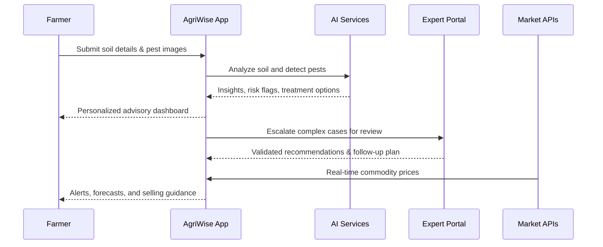
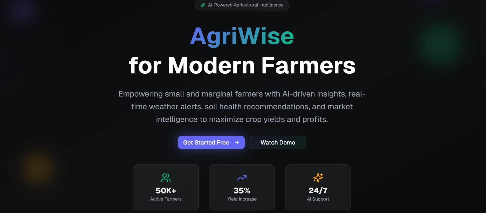

# 🌾 AgriWise - Crop Advisory Platform


Smart India Hackathon 2025 
Collaborative Crop Advisory & Market Intelligence Portal

[](https://agriwise-sih.vercel.app/)
[](https://nextjs.org/)
[](https://www.typescriptlang.org/)
[](https://tailwindcss.com/)

AgriWise is a next-generation, role-based decision support system that empowers farmers, agricultural experts, and policy stakeholders with actionable intelligence. It blends agronomic expertise, AI-powered insights, and real-time market intelligence into a cohesive experience built for India’s diverse farming communities.

---

## 🎯 Problem Statement

Indian agriculture faces persistent structural challenges:

- **Information asymmetry** leading to suboptimal crop planning and input usage.
- **Delayed pest & disease detection** causing crop loss and excessive pesticide use.
- **Volatile market prices** preventing farmers from realizing fair value.
- **Digital and linguistic divide** that limits adoption of existing digital tools.

## 🌱 Our Solution

AgriWise offers modular dashboards tailored to each stakeholder, delivering:

- Personalized crop, soil, and risk advisories.
- AI-assisted pest and disease detection with expert validation loops.
- Real-time market intelligence with configurable alerts and forecasting.
- Inclusive, multilingual, and voice-enabled interfaces for frictionless adoption.

---

## 🧭 System Architecture



### Platform Layers

- **Experience Layer**: Farmer dashboard, expert workspace, and policy dashboard with responsive UI and accessibility enhancements.
- **Intelligence Layer**: AI/ML models for pest detection, recommendation engines, and rule-based advisory flows.
- **Data Layer**: Soil datasets, weather feeds, satellite imagery, and market price APIs.
- **Integration Layer**: Secure APIs, webhooks, and messaging for alerts and collaborative workflows.

## 🔄 End-to-End Data Flow



## 🧩 Feature Suite

| Persona | Experience Highlights | Value Delivered |
| --- | --- | --- |
| **Farmers** | Voice-enabled navigation, localized language support, AI pest detection, market alerts | Reduced crop risk and higher profitability |
| **Experts** | Collaborative case management, treatment libraries, dynamic reporting | Faster advisory turnaround and knowledge sharing |
| **Government/Policy** | Macro dashboards, regional heatmaps, alert systems | Data-driven policy actions and targeted interventions |

---

## 📸 Visual Walkthrough



---

## 🛠️ Technology Stack

- **Frontend**: Next.js 14, React 18, TypeScript
- **UI/UX**: Tailwind CSS, Shadcn/UI, Lucide Icons, Framer Motion
- **Data & Analytics**: Recharts, custom hooks, modular state management
- **AI Integrations**: Image classification pipeline, rule-based advisory engine (extensible)
- **Infrastructure**: Deployed on Vercel with edge-ready optimizations

## 🚀 Getting Started

### Prerequisites

- Node.js 18+
- pnpm (recommended) or npm/yarn

### Installation & Development

1. Clone the repository:

   ```bash
   git clone https://github.com/debdyuti005/AgriWise.git
   cd AgriWise
   ```

2. Install dependencies:

   ```bash
   pnpm install
   ```

3. Run the local development server:

   ```bash
   pnpm dev
   ```

4. Visit the app at:

   ```text
   http://localhost:3000
   ```

### Production Deployment

The project is continuously deployed on Vercel: [https://agri-wise-six.vercel.app/](https://agri-wise-six.vercel.app/)


---

## 📅 Roadmap Highlights

- [ ] Integrate satellite-derived vegetation indices (NDVI) for early stress detection.
- [ ] Add offline-first progressive web app (PWA) support for low-connectivity regions.
- [ ] Expand language coverage to 12+ Indian languages with regional voice packs.
- [ ] Integrate market linkage APIs for direct procurement channels.
- [ ] Release mobile companion app for Android devices.

---

## 👤 Maintainer

- **Debdyuti Mondal** — [GitHub](https://github.com/debdyuti005)

## 📄 License

This project is released under the MIT License. See [LICENSE](LICENSE) for full terms.
